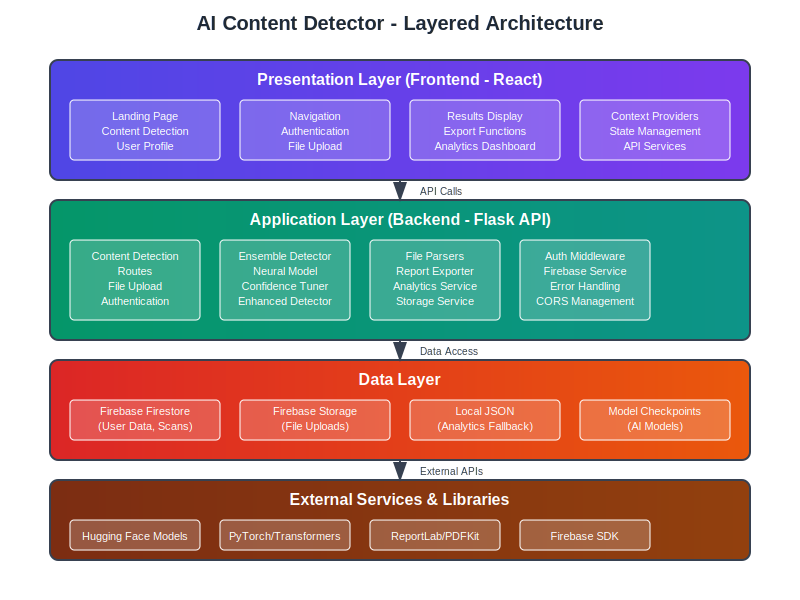
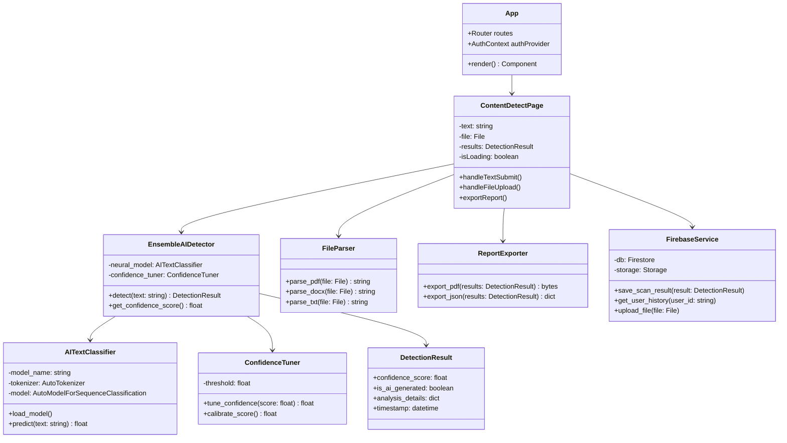

# AI Content Detector - System Design Documentation

## 1. Design Overview and Justification

### 1.1 System Purpose
The AI Content Detector is a web-based application designed to identify AI-generated content in text documents. The system provides users with confidence scores, detailed analysis, and exportable reports to help distinguish between human-written and AI-generated content.

### 1.2 Design Philosophy
The system follows a **layered architecture pattern** with clear separation of concerns:

- **Presentation Layer**: React-based frontend for user interaction
- **Application Layer**: Flask-based backend API for business logic
- **Data Layer**: Firebase and local storage for persistence
- **External Services**: Third-party AI models and libraries

### 1.3 Key Design Decisions and Justifications

#### 1.3.1 Technology Stack Selection
- **Frontend (React)**: Chosen for its component-based architecture, excellent ecosystem, and ability to create responsive, interactive user interfaces
- **Backend (Flask)**: Selected for its simplicity, flexibility, and excellent integration with Python ML libraries
- **Database (Firebase)**: Provides real-time capabilities, easy authentication, and scalable cloud storage
- **AI Models (Hugging Face Transformers)**: Leverages pre-trained models with proven accuracy in text classification

#### 1.3.2 Architectural Patterns
- **RESTful API Design**: Ensures stateless communication and easy integration
- **Component-Based UI**: Promotes reusability and maintainability
- **Ensemble Detection**: Combines multiple detection methods for improved accuracy
- **Microservice-Ready**: Modular design allows for future service decomposition

## 2. Layered Architecture



### 2.1 Presentation Layer (Frontend)
**Technology**: React with modern JavaScript (ES6+)

**Components**:
- **Page Components**: Landing, Content Detection, Profile, Authentication
- **UI Components**: Navigation, File Upload, Results Display, Export Functions
- **State Management**: Context API for authentication and global state
- **Routing**: React Router for single-page application navigation

**Responsibilities**:
- User interface rendering and interaction
- Form validation and user input handling
- API communication with backend services
- State management for user sessions and application data

### 2.2 Application Layer (Backend)
**Technology**: Flask with Python 3.8+

**Core Modules**:
- **API Routes**: Content detection, file upload, authentication, analytics
- **AI Detection Engine**: Ensemble detector with neural models
- **File Processing**: Support for multiple document formats (PDF, DOCX, TXT)
- **Report Generation**: PDF and JSON export capabilities
- **Authentication**: Firebase-based user management

**Responsibilities**:
- Business logic implementation
- AI model orchestration and inference
- File parsing and text extraction
- Report generation and export
- User authentication and authorization

### 2.3 Data Layer
**Technologies**: Firebase Firestore, Firebase Storage, Local JSON

**Data Stores**:
- **Firebase Firestore**: User profiles, scan history, analytics data
- **Firebase Storage**: Uploaded files and generated reports
- **Local JSON**: Analytics fallback and configuration data
- **Model Storage**: AI model checkpoints and configurations

**Responsibilities**:
- Persistent data storage and retrieval
- File storage and management
- User data privacy and security
- Analytics data collection and storage

### 2.4 External Services Layer
**Services**:
- **Hugging Face Models**: Pre-trained AI detection models
- **PyTorch/Transformers**: ML framework and model inference
- **ReportLab/PDFKit**: PDF generation libraries
- **Firebase SDK**: Authentication and database services

## 3. Design Class Diagram



## 4. Algorithms and Data Processing

### 4.1 AI Content Detection Algorithm

#### 4.1.1 Ensemble Detection Approach
The system employs an ensemble detection strategy that combines multiple detection methods:

**Primary Method: Neural Network Classification**
- **Model**: Fine-tuned RoBERTa (roberta-base-openai-detector)
- **Input**: Tokenized text sequences (max 512 tokens)
- **Output**: Probability score (0-1) indicating AI generation likelihood
- **Preprocessing**: Text cleaning, tokenization, attention mask generation

**Algorithm Flow**:
```python
def detect(text: string) -> DetectionResult:
    1. Preprocess text (clean, tokenize)
    2. Generate model inputs (input_ids, attention_mask)
    3. Run inference through neural model
    4. Apply confidence tuning
    5. Generate final classification result
    6. Return structured DetectionResult
```

#### 4.1.2 Confidence Scoring Algorithm
The confidence tuning mechanism adjusts raw model outputs to provide more reliable predictions:

**Calibration Process**:
- Applies statistical adjustments based on model performance metrics
- Considers text length and complexity factors
- Provides uncertainty estimates for edge cases

### 4.2 Text Processing Pipeline

#### 4.2.1 File Parsing Algorithm
Supports multiple document formats with unified text extraction:

```python
def parse_document(file: File) -> string:
    1. Detect file format (PDF, DOCX, TXT)
    2. Apply format-specific parser
    3. Extract raw text content
    4. Clean and normalize text
    5. Return processed text string
```

#### 4.2.2 Text Preprocessing
- **Normalization**: Unicode normalization, whitespace handling
- **Tokenization**: Subword tokenization using RoBERTa tokenizer
- **Chunking**: Long texts split into manageable segments
- **Encoding**: Convert to model-compatible input format

### 4.3 Report Generation Algorithm

#### 4.3.1 PDF Export Process
```python
def generate_pdf_report(results: DetectionResult) -> bytes:
    1. Create PDF document structure
    2. Add header with title and metadata
    3. Insert analysis results and confidence scores
    4. Add visual elements (charts, graphs)
    5. Include detailed breakdown sections
    6. Generate and return PDF bytes
```

## 5. Data Organization and Structure

### 5.1 Input Data Structure

#### 5.1.1 Text Input Format
```json
{
    "text": "string",
    "source": "direct_input | file_upload",
    "file_metadata": {
        "filename": "string",
        "file_type": "pdf | docx | txt",
        "file_size": "number",
        "upload_timestamp": "datetime"
    }
}
```

#### 5.1.2 File Upload Structure
- **Supported Formats**: PDF, DOCX, TXT
- **Size Limits**: 10MB maximum per file
- **Storage**: Firebase Storage with unique identifiers
- **Metadata**: Filename, size, type, upload timestamp

### 5.2 Model Data Structure

#### 5.2.1 Detection Results Format
```json
{
    "confidence_score": "float (0-1)",
    "is_ai_generated": "boolean",
    "analysis_details": {
        "model_version": "string",
        "processing_time": "float",
        "text_length": "number",
        "segments_analyzed": "number"
    },
    "timestamp": "datetime",
    "user_id": "string",
    "scan_id": "string"
}
```

#### 5.2.2 User Data Structure
```json
{
    "user_id": "string",
    "email": "string",
    "profile": {
        "display_name": "string",
        "created_at": "datetime",
        "last_login": "datetime"
    },
    "scan_history": [
        {
            "scan_id": "string",
            "timestamp": "datetime",
            "confidence_score": "float",
            "text_preview": "string"
        }
    ],
    "preferences": {
        "export_format": "pdf | json",
        "confidence_threshold": "float"
    }
}
```

### 5.3 Analytics Data Structure

#### 5.3.1 Usage Analytics
```json
{
    "daily_scans": "number",
    "total_users": "number",
    "average_confidence": "float",
    "file_type_distribution": {
        "pdf": "number",
        "docx": "number",
        "txt": "number"
    },
    "detection_results": {
        "ai_generated": "number",
        "human_written": "number",
        "uncertain": "number"
    }
}
```

## 6. Design Justifications

### 6.1 Scalability Considerations
- **Stateless API Design**: Enables horizontal scaling of backend services
- **Cloud-Based Storage**: Firebase provides automatic scaling for data storage
- **Modular Architecture**: Components can be scaled independently based on demand
- **Caching Strategy**: Model loading optimization reduces inference latency

### 6.2 Security and Privacy
- **Authentication**: Firebase Authentication provides secure user management
- **Data Encryption**: All data transmitted over HTTPS with end-to-end encryption
- **Privacy Protection**: User data stored securely with access controls
- **File Sanitization**: Uploaded files processed in isolated environments

### 6.3 Performance Optimization
- **Model Caching**: AI models loaded once and reused across requests
- **Asynchronous Processing**: Non-blocking operations for file uploads and processing
- **Frontend Optimization**: Code splitting and lazy loading for faster page loads
- **Database Indexing**: Optimized queries for user history and analytics

### 6.4 Maintainability and Extensibility
- **Clean Code Principles**: Well-documented, modular codebase
- **API Versioning**: Supports backward compatibility for future updates
- **Plugin Architecture**: Easy integration of new detection models
- **Comprehensive Testing**: Unit and integration tests ensure code quality

### 6.5 User Experience Design
- **Responsive Design**: Works seamlessly across desktop and mobile devices
- **Progressive Enhancement**: Core functionality works without JavaScript
- **Accessibility**: WCAG 2.1 compliant interface design
- **Real-time Feedback**: Live updates during processing and analysis

## 7. Future Enhancements

### 7.1 Planned Improvements
- **Multi-language Support**: Extend detection to non-English content
- **Advanced Analytics**: Machine learning insights for usage patterns
- **API Rate Limiting**: Implement usage quotas and throttling
- **Batch Processing**: Support for multiple file uploads simultaneously

### 7.2 Scalability Roadmap
- **Microservices Migration**: Decompose monolithic backend into services
- **Container Deployment**: Docker containerization for easier deployment
- **Load Balancing**: Implement load balancers for high availability
- **CDN Integration**: Content delivery network for global performance

This system design provides a robust, scalable, and maintainable foundation for AI content detection while ensuring excellent user experience and reliable performance.